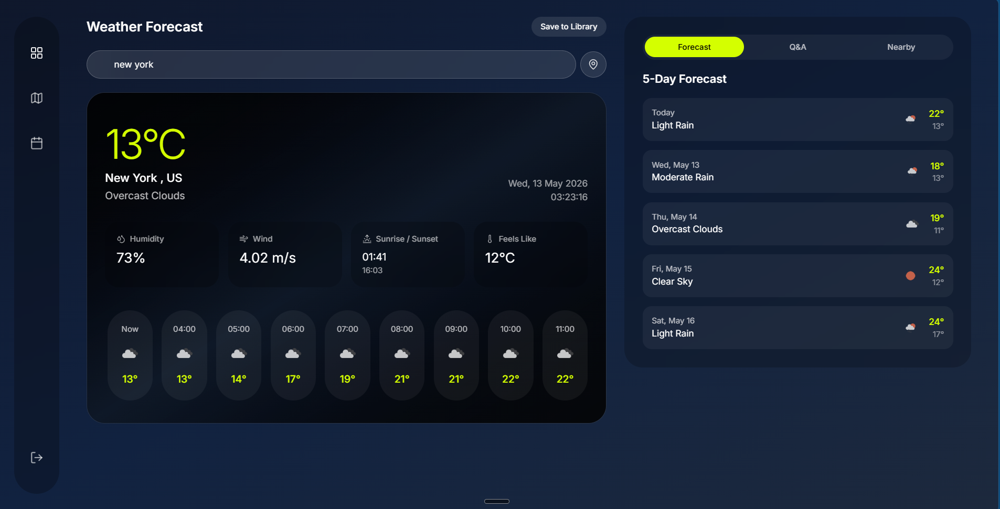

# Weather App

Full-stack weather application with live weather, saved locations, history, AI Q&A, generated visual backgrounds, nearby places, and responsive web/mobile UI.

## Demo

Click the screenshot below to open the demo video, or use this link: [Demo video link](https://example.com/demo-video-placeholder).

<p align="center">
  <a href="https://example.com/demo-video-placeholder" title="Watch the demo video">
    
  </a>
</p>


## Features

### Backend

- OpenWeatherMap One Call API 3.0 for current weather, forecasts, time machine data, and overview.
- **Mapillary street images lookup** using the latitude/longitude resolved from OpenWeather.
- **NanoBanana image generation** using Mapillary images to create weather background images.
- **DeepSeek Q&A** over forecast context; each question sends the forecast in the system prompt.
- **Google Maps Places API** for nearby restaurants and hotels.
- **SQLite for development and PostgreSQL for production**, controlled through environment variables.
- CRUD support for saved locations, including updating saved-location names/tags.

### Frontend

- Responsive Next.js UI for desktop and mobile.
- Consistent themed interface across weather, saved locations, and history.
- Dynamic visual theme based on weather/time context.
- Minimal, utility-oriented UI focused on weather actions and saved data.

## Tech Stack

- Frontend: Next.js, TypeScript.
- Backend: FastAPI with SQLAlchemy.
- Databases: SQLite for local DB, PostgreSQL for production DB.
- APIs: OpenWeatherMap, Mapillary, NanoBanana/Gemini, DeepSeek, Google Maps Places.

## Requirements

- Backend dependencies are listed in `backend/requirements.txt`.
- Frontend dependencies are listed in `frontend/package.json`.
- Python `3.13+` is recommended.
- Node.js compatible with the installed Next.js version is required.


# Backend Setup

## Environment Variables

Create `backend/.env` with the required keys:

```env
DATABASE_URL=sqlite:///./weather.db
OPENWEATHER_API_KEY=your_openweather_key
GOOGLE_MAPS_API_KEY=your_google_maps_key
MAPILLARY_TOKEN=your_mapillary_token
DEEPSEEK_API_KEY=your_deepseek_key
NANOBANANA_API_KEY=your_nanobanana_key
CORS_ORIGINS=http://localhost:3000
```

For production, set `DATABASE_URL` to the PostgreSQL connection string and `ENVIRONMENT` to production.

## Run Locally

```bash
cd backend
python -m venv .venv
.\.venv\Scripts\activate
pip install -r requirements.txt
alembic upgrade head
uvicorn app.main:app --reload
```

Backend runs at `http://localhost:8000`.

# Frontend Setup

## Run locally

```bash
cd frontend
npm install
npm run dev
```

Frontend runs at `http://localhost:3000`.